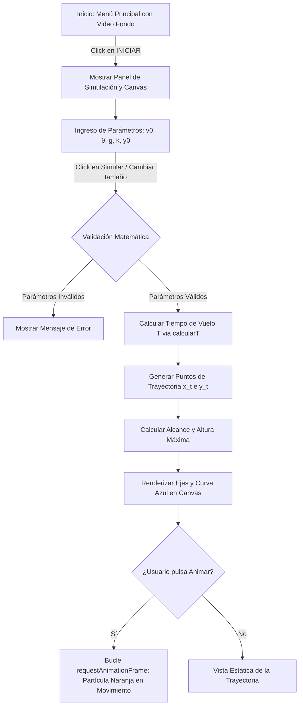

# 🚀 Simulador de Movimiento Parabólico con Rozamiento del Aire

[](https://developer.mozilla.org/es/docs/Web/HTML)
[](https://developer.mozilla.org/es/docs/Web/JavaScript)
[](https://developer.mozilla.org/es/docs/Web/API/Canvas_API)
[](https://developer.mozilla.org/es/docs/Web/CSS)
[](https://luisfelipe25.github.io/Simulador_Movimiento_Parabolico/)

Un simulador interactivo web de **movimiento parabólico** (lanzamiento de proyectiles) que va más allá de la física elemental al incorporar **resistencia del aire (rozamiento)** y **altura inicial del lanzamiento ($y_0$)**. 

Diseñado con una interfaz *Mobile-First*, menús cinemáticos con video de fondo y renderizado vectorial continuo mediante la **HTML5 Canvas API**.

🌐 **Demo En Vivo**: [https://luisfelipe25.github.io/Simulador_Movimiento_Parabolico/](https://luisfelipe25.github.io/Simulador_Movimiento_Parabolico/)

---

## 📐 Complejidad Matemática y Modelo Físico

En el estudio tradicional de la física (vacío), el movimiento parabólico se modela asumiendo desaceleración nula en el eje horizontal y gravedad constante en el vertical. Sin embargo, en el mundo real, los objetos experimentan **resistencia aerodinámica**. 

Este proyecto modela la trayectoria considerando un coeficiente de rozamiento $k$ ($\text{s}^{-1}$) que atenúa el movimiento en ambos ejes y permite lanzar proyectiles desde una plataforma elevada $y_0$.

### 1. Ecuaciones Cinemáticas del Proyecto

Las coordenadas del proyectil en función del tiempo $t$ se calculan mediante:

- **Posición Horizontal $x(t)$**:
  $$x(t) = v_0 \cos(\theta) \cdot t - \frac{1}{2} k v_0 \cos(\theta) \cdot t^2$$

- **Posición Vertical $y(t)$**:
  $$y(t) = y_0 + v_0 \sin(\theta) \cdot t - \frac{1}{2} g t^2 - \frac{1}{2} k v_0 \sin(\theta) \cdot t^2$$

Donde:
- $v_0$: Velocidad inicial de lanzamiento ($\text{m/s}$).
- $\theta$: Ángulo de lanzamiento respecto al suelo ($\text{grados}$).
- $g$: Aceleración de la gravedad ($\text{m/s}^2$).
- $k$: Coeficiente de resistencia/rozamiento con el aire ($\text{s}^{-1}$).
- $y_0$: Altura inicial desde la que se efectúa el disparo ($\text{m}$).

### 2. Cálculo Explícito del Tiempo de Vuelo ($T$)

Para obtener el instante exacto $T$ en el cual el proyectil impacta contra el suelo ($y(T) = 0$), el simulador resuelve analíticamente la condición límite, derivando la expresión:

$$T = \frac{v_0 \sin(\theta)}{g + k v_0 \sin(\theta)} \left( 1 + \sqrt{1 + \frac{2 y_0 (g + k v_0 \sin(\theta))}{v_0^2 \sin^2(\theta)}} \right)$$

> [!IMPORTANT]
> **Efecto de las variables:**
> - Cuando $k = 0$ y $y_0 = 0$, la ecuación degenera en la fórmula clásica elemental $T = \frac{2 v_0 \sin(\theta)}{g}$.
> - Si $k > 0$, el componente de frenado incrementa la tasa de caída efectiva en la componente vertical y amortigua el avance en el eje $X$, acortando el alcance total y alterando la simetría de la parábola tradicional.

---

## ✨ Características Destacadas

- 🧮 **Motor de Física Dinámico**: Cálculo instantáneo del tiempo de vuelo ($T$), alcance horizontal máximo ($\text{Alcance}$) y altura máxima alcanzada ($\text{Altura Max}$).
- 🎨 **Visualización Vectorial Interactiva**: Gráfica $Y$ vs $X$ generada dinámicamente sobre HTML5 Canvas con auto-escalado según las dimensiones de la pantalla.
- 🔴 **Animación en Tiempo Real**: Simulación de la partícula siguiendo la trayectoria con control de animación/pausa (`Animar / Pausa`).
- 📱 **Diseño Responsive (Mobile-First)**: Adaptable a pantallas de smartphones, tablets y monitores de escritorio.
- 🎬 **Menú Cinemático**: Interfaz de bienvenida interactiva con fondo de video en alta definición (`Fondo.mp4`).
- 💡 **Retroalimentación y Validaciones en Vivo**: Tooltips explicativos al pasar el cursor o hacer focus en cada campo de parámetro, junto con manejo de excepciones matemáticas (ej. raíces negativas o división por cero).

---

## 🗺️ Diagrama de Flujo del Simulador



---

## 🎛️ Parámetros de Entrada

| Parámetro | Símbolo | Unidad | Valor por Defecto | Descripción |
| :--- | :---: | :---: | :---: | :--- |
| **Velocidad Inicial** | $v_0$ | $\text{m/s}$ | `20` | Velocidad con la que sale impulsado el proyectil. |
| **Ángulo de Lanzamiento** | $\theta$ | $\text{grados}$ | `45` | Ángulo de tiro medido respecto a la horizontal. |
| **Gravedad** | $g$ | $\text{m/s}^2$ | `9.81` | Aceleración gravitacional de referencia (Tierra). |
| **Coeficiente de Rozamiento** | $k$ | $\text{1/s}$ | `0.05` | Factor de resistencia del medio/aire al avance. |
| **Altura Inicial** | $y_0$ | $\text{m}$ | `2` | Elevación inicial sobre el suelo desde donde se dispara. |

---

## 📁 Estructura del Proyecto

```text
Simulador_Movimiento_Parabolico/
├── index.html       # Aplicación completa (Estructura HTML, Estilos CSS y Lógica JS)
├── Fondo.mp4        # Video de fondo para el menú cinemático inicial
└── README.md        # Documentación oficial del proyecto
```

---

## 🌐 Demo En Vivo

Accede a la simulación interactiva desplegada en GitHub Pages:
👉 **[https://luisfelipe25.github.io/Simulador_Movimiento_Parabolico/](https://luisfelipe25.github.io/Simulador_Movimiento_Parabolico/)**

---

## 🚀 Instalación y Ejecución

No se requieren dependencias externas ni compilación previa. El proyecto está construido exclusivamente con tecnologías web nativas.

### Opción 1: Apertura Directa
1. Clona o descarga el repositorio:
   ```bash
   git clone https://github.com/LuisFelipe25/Simulador_Movimiento_Parabolico.git
   ```
2. Abre el archivo [`index.html`](file:///c:/Users/felip/OneDrive/Desktop/Simulador_Movimiento_Parabolico/index.html) haciendo doble click o arrastrándolo a cualquier navegador web moderno (Chrome, Edge, Firefox, Safari).

### Opción 2: Servidor Local de Desarrollo
Si deseas servir el proyecto mediante un servidor web local:

#### Usando Python:
```bash
# En el directorio del proyecto
python -m http.server 8000
```
Luego abre `http://localhost:8000` en tu navegador.

#### Usando Node.js:
```bash
npx serve .
```

---

## 🛠️ Tecnologías Utilizadas

- **HTML5**: Semántica web, contenedor `<canvas>` y elemento `<video>` en bucle.
- **CSS3**: Estilos personalizados, CSS Grid, Flexbox, media queries responsive y estética moderna.
- **JavaScript (ES6+)**: Lógica física, manipulación del DOM, matemáticas cinemáticas y `requestAnimationFrame` para animaciones suaves.

---

## 📝 Licencia

Este proyecto se distribuye bajo la licencia MIT. Consulta el repositorio oficial [Simulador_Movimiento_Parabolico](https://github.com/LuisFelipe25/Simulador_Movimiento_Parabolico) para más información.
